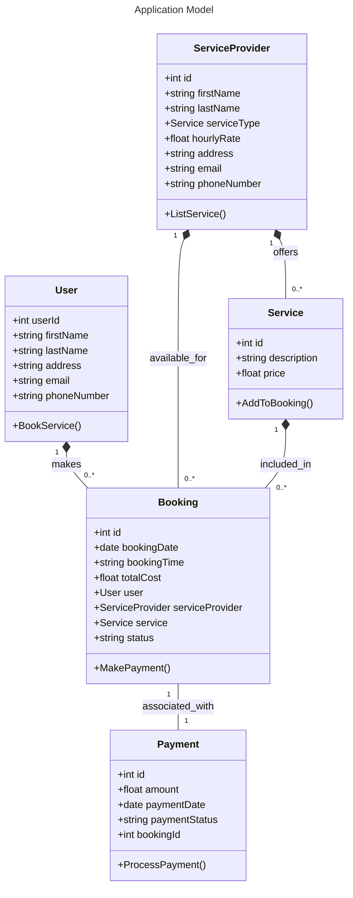

<!--[](https://classroom.github.com/a/DIHvCS29)-->

# FixFinder

## Project Description

FixFinder is a fully web-based platform that connects end users with local service providers across a range of services, including electricians, handymen, and other skilled professionals. The application supports two distinct user roles:

- **End Users**: End users can search for nearby service providers based on their specific requirements and location. They can view detailed provider profiles, specify required service hours, book services, and efficiently manage their bookings through a personalized dashboard.

- **Service Providers**: Service providers can manage their offerings, set pricing, and utilize a dashboard to gain insights into their revenue and performance.

FixFinder aims to streamline service discovery and booking through a user-friendly interface. End users can effortlessly search for nearby service providers based on their specific requirements, view detailed provider profiles, specify service hours, and manage bookings through a personalized dashboard. Service providers, on the other hand, can efficiently manage their offerings, set competitive pricing, and leverage a dedicated dashboard to monitor their performance, bookings, and revenue insights. FixFinder bridges the gap between users and providers, ensuring a seamless experience for both parties.

## Tech Stack

| Technology                                                                                                                      | Description                                              |
| ------------------------------------------------------------------------------------------------------------------------------- | -------------------------------------------------------- |
|                              | Front-end framework for building user interfaces         |
|                               | State management for handling complex application state  |
|                                             | Backend server framework for RESTful API development     |
|                         | NoSQL database for data persistence                      |
|  | Middleware for handling server requests and APIs         |
|                                     | Progressive Web App for offline and mobile compatibility |
|                                    | Multilingual support for global users                    |

---

## Project Requirements & Features

- **CRUD Operations**: Full create, read, update, and delete functionality.
- **Routing & State Management**: Uses routing for multiple pages and Redux for global state management.
- **Internationalization**: Supports multiple languages for a wider audience.
- **PWA (Progressive Web App)**: Ensures downlaod feature and offline access.
- **Domain Driven Design (DDD)**: The REST API follows best practices for design and RESTful principles outlined by Microsoft’s guidelines on [API Design Best Practices](https://learn.microsoft.com/en-us/azure/architecture/best-practices/api-design).
- **Component Structure**: Follows a modular approach with small, reusable components for maintainability.
- **Professional UI**: Focus on UX and professional design standards.
- **Fugu Capabilities**: Integration of advanced web app features to enhance functionality.

---

## Repository Structure

The project repository will include two primary directories:

1. **app**: Frontend code (React, Redux, SCSS).
2. **service**: Directory for REST API Service | Server-side code with configurations (Node.js, Express.js, MongoDB).

Other Contents:

- **Presentation PPT**: Project Title, Project Description, Team member names, Screenshots from the project

---

## Installation Guide

1. Clone the repository

```bash
git clone https://github.com/info-6150-fall-2024/final-project-syntaxsquad.git
```

## Object Model Using Domain Driven Design for FixFinder Application


